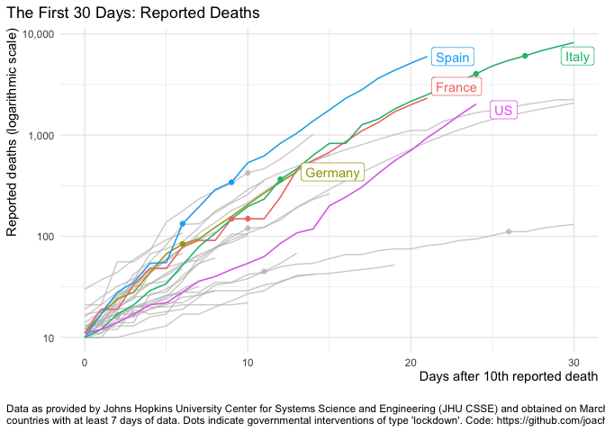

Joachim Gassen

# Download, Tidy and Visualize Covid-19 Related Data

## Disclaimer

I am an applied economist studying the economic effects of regulatory
interventions on corporate transparency and leading the Open Science
Data Center (OSDC) of the [TRR 266 Accounting for
Transparency](https://accounting-for-transparency.de), which is funded
by the German Science Foundation (DFG). The OSDC has the objective to
make research transparent in a way that others can contribute and
collaborate.

This is the spirit that motivated me to set up this package. I am
clearly no epidemiologist so I will abstain from from providing
infrastructure for analyzing the spread of the disease or estimating the
effects of non-pharmaceutical interventions. Instead this package serves
the purpose to facilitate the use of various Covid-19 related data
sources with a special focus on non-pharmaceutical interventions.

In that way, I hope that it might be helpful for others that are
interested in doing research on the Covid 19 pandemic by promoting the
benefits of open science.

## Why yet another package on Covid-19?

There are at least already two packages that provide data and
infrastructure related to Covid-19:

  - `{nCov2019}`: This
    [package](https://github.com/GuangchuangYu/nCov2019) has a focus on
    Chinese data but also contains data on other countries and regions.
    It contains a shiny dashboard.
  - `{conronavirus}`: This
    [package](https://github.com/RamiKrispin/coronavirus) provides the
    Johns Hopkins University CSSE dataset together with a dashboard

Other than the two packages above, the key objective of the
{tidycovid19} package is to provide *transparent* access to *various*
data sources. It does not contain any data per se. Instead, it provides
functions to pull data from publicly available data sources.

For those interested in speedy downloads it alternatively provides the
option to download the data from the cached data in this repo (stored in
the directory `cached_data`). The cached data will be updated daily.

## The Data

Currently, the package offers the following functions to download data:

  - `download_jhu_csse_covid19_data()`: Downloads and tidies [Covid-19
    data from the Johns Hopkins University CSSE Github
    Repo](https://github.com/CSSEGISandData/COVID-19). This data has
    developed to a standard resource for researchers and the general
    audience interested in assessing the global spreading of the virus.
    The data is aggregated to the country level.
  - `download_acaps_npi_data()`: Downloads and tidies the [Government
    measures dataset provided by the Assessment Capacities Project
    (ACAPS)](https://data.humdata.org/dataset/acaps-covid19-government-measures-dataset).
    These relatively new data allow researchers to study the effect of
    non-pharmaceutical interventions on the development of the virus.
  - `download_google_trend_data()`: Downloads and tidies [Google
    Trends](https://trends.google.com/trends/) data on the search volume
    for the term “coronavirus” (Thank you to Yan Ouaknine for bringing
    up that idea\!). This data can be used to assess the public
    attention to Covid-19 across countries (see plot below) and over
    time within a given country.
  - `download_wbank_data()`: Downloads and tidies additional country
    level information provided by the [World
    Bank](https://data.worldbank.org) using the {wbstats} package. These
    data allow researchers to calculate per capita measures of the virus
    spread and to assess the association of macro-economic variables
    with the development of the virus.
  - `download_merged_data()`: Downloads all data sources and creates a
    merged country-day panel sample.

## Visualization

The focus of the package lies on data collection and not on
visualization as there are already many great tools floating around. The
function `plot_covid19_spred()` however, allows you to quickly visualize
the spread of the virus in relation to governmental intervention
measures.

``` r
#remotes::install_github("joachim-gassen/tidycovid19")

library(tidycovid19)

merged <- download_merged_data(cached = TRUE)
plot_covid19_spread(merged, highlight = c("ITA", "ESP", "FRA", "DEU", "USA"), 
                    intervention = "lockdown")
```

<!-- -->

## Blog post

[Click
here](https://joachim-gassen.github.io/2020/03/merge-covid-19-data-with-governmental-interventions-data/)
for the blog post that showcases some descriptive visuals to see what
one can do with the data retrieved by this package.
